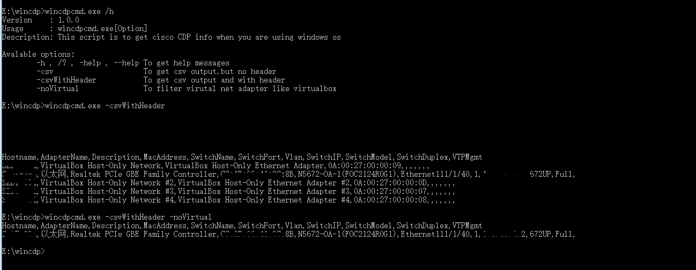
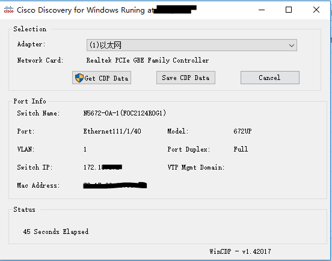

# wincdp
用于在Windows 下获取Cisco交换机的CDP信息的工具，通过抓包的方式获取CDP数据，然后提取该端口的交换机信息，如交换机名称、连接的端口号、VLAN、交换机IP地址等等。

抓包工具使用的是[windows tcpdump](https://www.microolap.com/products/network/tcpdump/)

* wincdpcmd 一个用于命令行下的CDP信息获取工具。

  wincdpcmd -h 可以获取帮助，用于输出所有网卡的CDP信息,便于网络排错。可以输出不同格式，默认以List方式输出，类似下列方式。

  

* wincdp ,重写了 部分https://github.com/chall32/WinCDP 的代码，之前的AutoIT源代码编译GUI后总是不工作。

  
